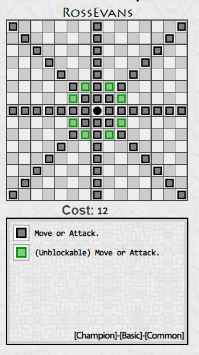
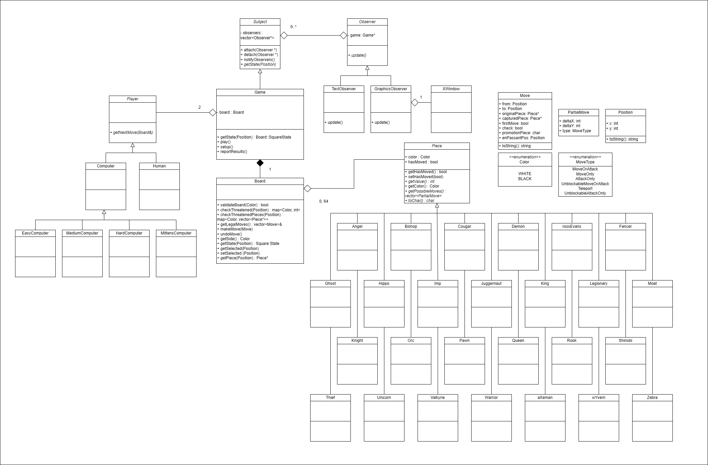

Hello this is a chess game

# Chess Evolved Offline - CS247 Spring 2024

## Overview

This project is a chess game implementation using both text-based and graphical XWindow-based
displays. The game is built using observer patterns to separate game logic from the display.
In addition to the standard chess pieces, this version introduces 20 new pieces.
Hence the "Evolved" in the game name.

For example, take a look at the piece "Ross Evans":

## Features

- Chess Evolved Offline supports human vs human, human vs computer, and computer vs computer games.
- Computer players have multiple difficulty levels:
  - Level 1: Random legal moves.
  - Level 2: Prefers capturing moves and checks.
  - Level 3: Avoids capture, prefers capturing moves, and checks.
  - Level 4: More advanced strategies.

## Commands

- `game` `white-player` `black-player`: Start a new game. The players can be `human` or `computer1`, `computer2`, `computer3`, and `computer4`.
- `move` `e2` `e4`: Move a piece from `e2` to `e4`. For castling: `move e1 g1` or `move e1 c1` (king moves two squares towards the rook castling with it).
  For pawn promotion: `move e7 e8 Q`.
- `resign`: Resign the game which gives a point to the opposing player.
- `setup`: Enter setup mode to configure the board.
  - `+` `K` `e1`: Places piece `K` at `e1`.
  - `-` `e1`: Removes the piece on `e1`.
  - `=` `colour`: Set the next turn to be `white` or `black`.
  - `done`: Exit setup mode.

The game otherwise follows normal chess rules of checkmating, stalemating, scoring, and alternating turns. Except there is no draws from threefold repetitions or the fifty-move rule.

## Setup and Compilation

1. Ensure you have the necessary libraries for graphical display. For Unix-based systems, use:
   g++14 window.cc graphicsdemo.cc -o graphicsdemo -lX11

2. For graphical display setup:
   - Linux: SSH with the `-Y` option.
   - Mac: Download and run `xQuartz`, SSH with the `-Y` option.
   - Windows: Use `PuTTY` with X server like `XMing`.

## UML Diagram

